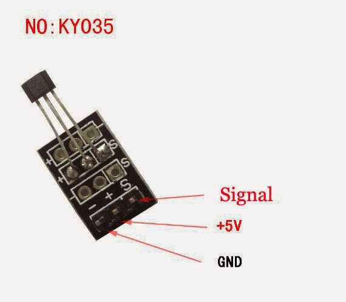

# Sensor d'efecte Hall

Els sensors d'efecte Hall poden detectar la presència de camps magnètics, per tant es poden fer servir juntament amb un imant per a detectar moviments o rotacions.

En la figura de sota es pot veure el mòdul d'efecte Hall que farem servir. Es pot apreciar a què correspon cada pota del sensor. Habitualment la pota corresponent a la senyal té una S gravada, la pota corresponent a GND té un signe - i, a vegades la pota d'alimentació (Vcc) té un signe +.




En aquest cas utilitzarem un imant per a provar el sensor. 

A sota podem veure el codi Python corresponent.


```python
from microbit import *

while True:
    magnet = pin5.read_digital()
    if magnet == True:
        display.show(Image.YES)
    else:
        display.show(Image.NO)
    sleep(500)

```
