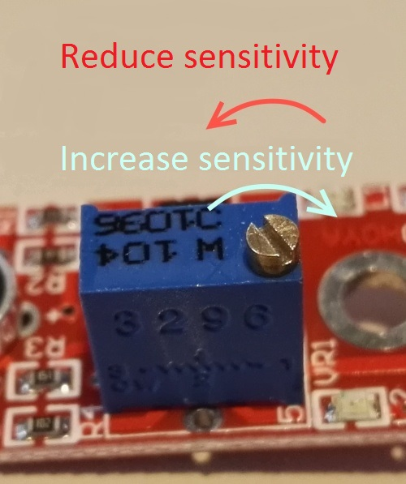

# Detecció de foc amb infraroigs

El mòdul KY-026 és un sensor d'infraroigs que es pot fer servir per a fer detecció de foc, ja que detecta flames de longituds d'ona que van de 760 nm a 1100 nm. 


Girant el cargol es pot ajustar la sensibilitat del sensor.




## Codi per a utilitzar-lo com a sensor digital


```python
from microbit import *

while True:
    flame = pin4.read_digital()
    if flame == True:
        display.show(Image.YES)
    else:
        display.show(Image.NO)
    sleep(500)

```

## Codi per a utilitzar-lo com a sensor analògic


```python
from microbit import *

while True:
    flame = pin4.read_analog()
    display.scroll(flame)
    sleep(500)
```
