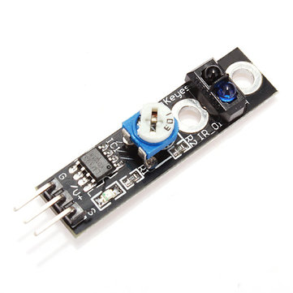

# Detectar obstacles amb sensors infraroigs

El mòdul KY-032 que es veu a sota ha estat dissenyat per detectar obstacles. Està compost per un emissor de raigs infraroigs i un receptor que rep el rebot dels raigs sobre un obstacle que es trobi davant d'ell. Si el sensor no rep cap senyal vol dir que no hi ha obstacle i els raigs emessos es perden però, quan rep senyal vol dir que hi ha un obstacle davant d'ell. La distància de detecció es pot ajustar amb els potenciómetres que hi ha a la placa del sensor.


Aquest sensor porta 4 pins, un per a Vcc que es pot alimentar amb 3,3 V o 5 V, el de terra (GND) i el anomenat com OUT que correspon a la sortida cap a la micro:bit i que dona la lectura. Hi a un altre pin amb el rètol EN que vol dir "Enable" i que es pot fer servir per activar o desactivar el sensor. El sensor queda sempre activat si s'utilitza el pont que curtcircuita els pins que hi ha sobre la placa del sensor que es veu a la figura en verd.


El mòdul KY-033 funciona de manera semblant, peró per la ubicació dels sensor s'acostuma a fer-lo servir com a seguidor de línies en robots. El sensor es pot veure a sota i també es pot ajustar el seu valor llindar amb el potenciómetre que porta a la placa.




El codi per a detectar un obstacle es pot veure a sota. En aquest cas, quan es detecta l'únic que fa el programa és mostrar a la pantalla de la micro:bit el símbol &#10004; si detecta moviment i el símbol &#10005; si no el detecta. Però podem adaptar el codi per a que en aquest cas hi hagi un actuador que faci alguna cosa, com ser encendre un llum o que s'accioni un motor o soni una alarma.


```python
from microbit import *

while True:
    detect = pin5.read_digital()
    if detect == True:
        display.show(Image.YES)
    else:
        display.show(Image.NO)
    sleep(500)

```
