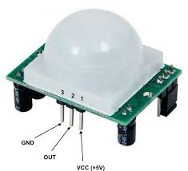

# Detecció de moviments amb infrarroigs


El sensor que es veu a la imatge inferior és un HC-SR501, es tracta d'un sensor infrarroig passiu (PIR), i serveix per a detectar moviments. Resulta habitual trobarlos als lavabos públics per encendre la llum quan detecta la presencia de persones.




Si vols saber més de com funcionen els PIR pots consultar <a href="https://learn.adafruit.com/pir-passive-infrared-proximity-motion-sensor/how-pirs-work" target="_blank">aquesta pàgina</a>.

A continuació tenim un exemple de codi que permet detectar el moviment:


```python
from microbit import *

while True:
    # Utilitzem em pin3 per llegir el sensor
    input_state = pin3.read_digital()  
    if input_state == True:
        display.show(Image.YES)
    else:
        display.show(Image.NO)
    sleep(500)

```
