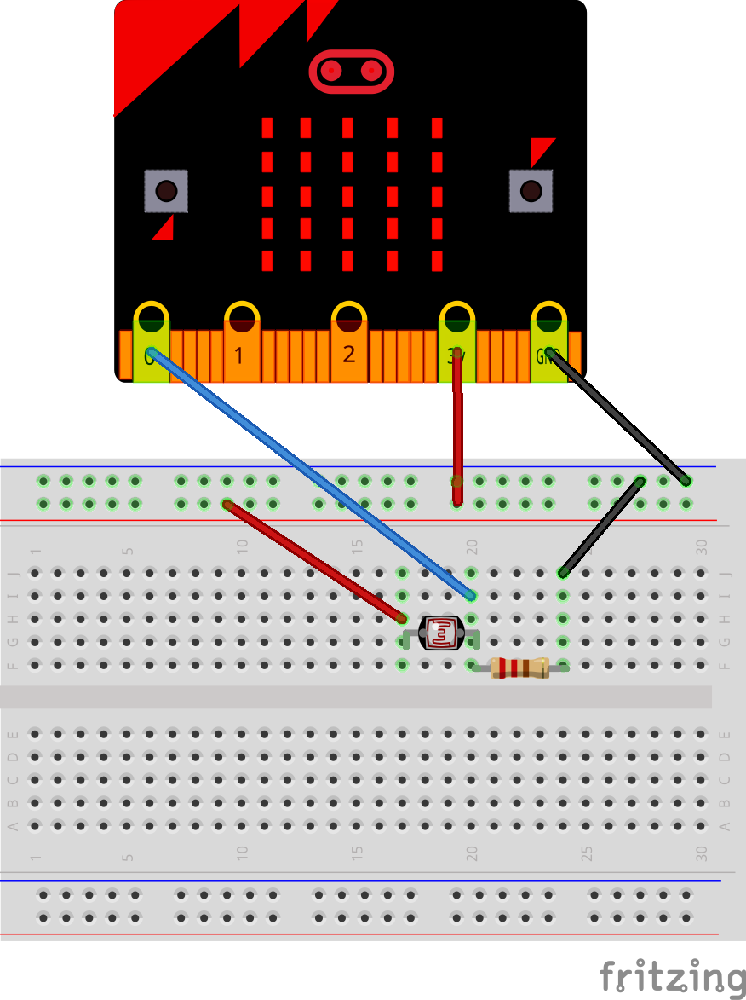
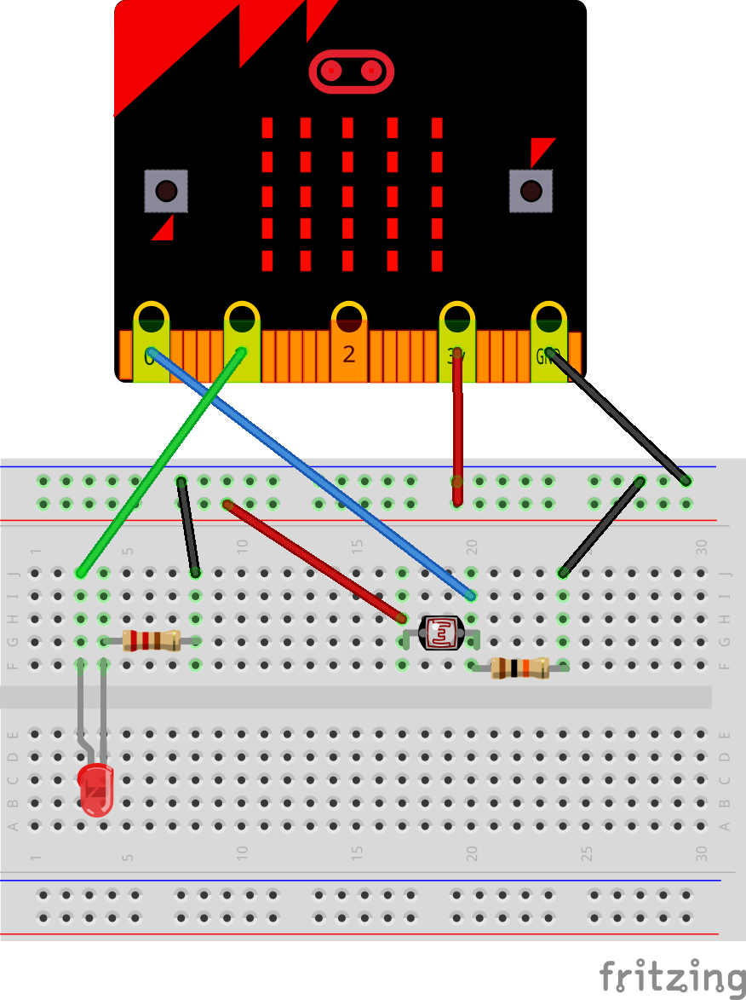

# Sensors

Els sensors són dispositius que poden captar informació del seu voltant. Aquesta informació es pot processar i es poden prendre decisions per canviar alguna situació. Un exemple d'utilització de sensors són els fanals del carrer. Els fanals s'encenen quan es fa de nit no perquè hi hagi algú que engega un interruptor, sinó perquè els fanals tenen un sensor que està captant la intensitat de llum que li arriba i quan aquest valor baixa per sota d'un determinat valor llindar, el lllum s'encén. El precessament de la informació la fa un microcontrolador amb capacitats semblants a les de la placa microbit.

Els sensors es poden classificar de diverses maneres. Si pensem en la informació que llegeigen tenim sensors de temperatura, de llum, de presió, d'humitat, de gasos, etc. Si considerem la forma en la que la informació es transmet, podem classificar els sensor en dues categories: sensors digitals i sensors analògics.

## Sensors digitals

Els sensors digitals es caracteritzan per transmetre informació en forma binària, es a dir, comunica dues possibilitats (Sí/No, Veritat/Fals, 1/0, Tancat/Obert, etc.). Un exemple d'aquest tipus de sensors és un polsador, que es pot considerar com un sensor de contacte. Si posem un sensor d'aquest tipus a un robot podríem saber quan el robot topa amb alguna cosa perquè el polsador canviaria d'estat i aleshores el robot podria fer un canvi de direcció de moviment, per exemple. En aquest cas el polsador té un estat quan està alliberat i un altre quan està premut.

## Sensor analògics

Hi ha sensors que no donen un senyal binari sinó que prenen molts valors, com pot ser el cas d'un sensor de temperatura. Un termòmetre no diu si hi ha temperatura o no, sinó que dona tot un ventall de valors possibles de temperatura. Com a exemple farem servir una resistència depenent de la llum, també anomenat LDR (Light Dependent Resistor) o fotorresistor. 

## Utilitzant una LDR com sensor de llum

Per a connectar la LRD a la nostra microbit construirem un divisor de tensió com es veu a la figura següent.

<div align="middle">

</div>

Com que el valor de la resistència de la LDR anirà canviant a mesura que canvia la intensitat de la llum que l'hi arriba, també canviarà el voltatge que tindrà el pin de la microbit. És aquest nivell de voltatge el que llegirà la microbit, prenent valors que van des de 0 fins a 1023. 

### Materials

Per a construir el circuit utilitzarem els següents materials:

* Placa microbit
* Cable microUSB
* Protoboard
* Cables cocodril
* Cables per a protoboard mascle-mascle
* 1 LDR
* 1 resistència de $10 \mathrm{k\Omega}$

### Connexions

A la figua es pot veure el circuit muntat.

<div align="middle">

</div>

### El codi

El codi per a llegir la informació proporcionada per la LDR es pot veure a continuació:


```python
from microbit import *
     
while True: 
        n = pin0.read_analog() # llegeix el nivell al pin0 i el guarda a la variable n
        display.show(n)        # mostra a la pantalla de la microbit el valor d'n
        sleep(500)             # espera mig segon
```

Hauríem de veure com canvia el valor mostrat a la pantalla segons el nivell de llum que arriba a la LDR. Proveu de tapar la LDR amb la mà i observeu com  canvia el valor mostrat a la matriu de LED de la microbit.

## Controlant un fanal

Simularem ara el funcionament d'un fanal automàtic. farem que el fanal s'encengui quan el nivell de llum baixa per sota d'un determinat valor, el qual anomenarem **valor llindar** de la llum. Per trobar aquest valor llindar el que farem és mesurar el valor que pren la variable `n ` quan li arriba molta llum i apuntarem aquest valor. A continuació tapem la LDR amb la mà i tornem a mesurar el valor que pren `n` i l'apuntem. Prendrem com a valor llindar un nivell que estigui al mig d'aquests dos valors, es a dir, el valor mitjà:

$$\text{valor llindar} = \frac{\text{valor màxim} + \text{valor mínim}}{2}$$ 

Quan el nivell de llum sigu alt també ho serà el valor d'`n`, i quan el nivell sigui baix també ho serà el valor d'`n`. 

### Material

Per simular el fanal farem servir un LED que connectarem al pin 1 de la microbit per a la LDR mantindrem el circuit anterior. Per tant, al material anterior hem d'afegir:

* Cables cocodril i de protoboard
* LED
* Resistència més gran que $50\,\Omega$ (per protegir el LED)

### El circuit

El circuit del fanal quedarà:

<div align="middle">

</div>

### El codi

El codi per a controlar el fanal el podem veure a sota.


```python
from microbit import *

while True:
    n = pin0.read_analog()          # Es llegeix el nivell de llum i es guarda a la variable n
    if n < 150:                     # El valor llindar utilitzat aquí és de 150
        pin1.write_digital(1)       # Si el valor d'n cau per sota de 150 el LED s'encèn
    else:
        pin1.write_digital(0)       # En cas contrari el LED s'apaga
    sleep(500)                      # Espera mig segon
```

Podem observar en el codi que el valor llindar és el que determina si el LED s'encèn o no. Observeu que el valor llindar utilitzat en el codi de dalt no té perquè ser el mateix que necessiteu per al vostre circuit, ja que depen del valor de llum ambient i de la LDR utilitzada.


## Exercici

Feu un muntatge utilitzant un polsador com sensor digital, si el polsador està premut que encengui el LED i si el sensor està lliure que el LED s'apagui. Ajuda: per a llegir informació digital hem de fer servir l'ordre `read_digital()`. 
Si necessiteu més informació consulteu la documentació: [https://microbit-micropython.readthedocs.io](https://microbit-micropython.readthedocs.io)
