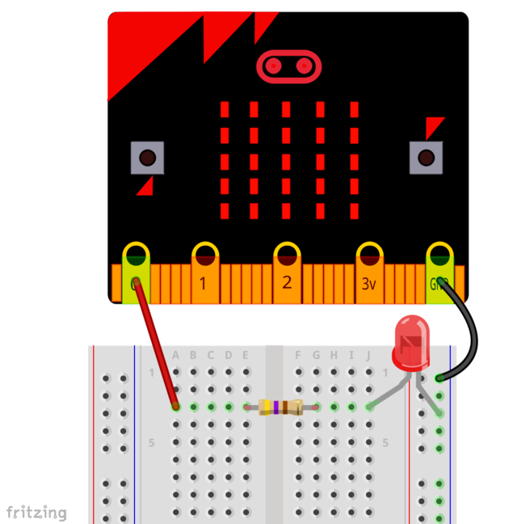

# Controlar un LED amb la microbit

Aprendrem aquí com connectar una microbit a un protoboard i com encendre i apagar un LED, controlar la seva brillantor i també construirem un semáfor.


<div align="middle">
<video width="60%">
      <source src="img/leds_traffic.mp4" type="video/mp4">
</video></div>

Primer començarem per encendre un LED i després afegirem dos LED més per fer el semàfor.

## Material necessari
* microbit
* Protoboard
* Cables
* 3 LED (verd, groc, vermell)
* Resistències de 220 ohm

## Controlant un LED

Connecteu el resistor i el LED com mostra l'esquema inferior. Assegureu-vos que la pota més llarga del LED (terminal positiu) és el de l'esquerra. El resistor no té polaritat, per tent, no importa com el connecteu.

<div align="middle">

</div>

La raó per la que connectem el resistor en sèrie amb el LED és limitar la intensitat de corrent que hi circula pel circuit i, d'aquesta manera, protegit el LED de sobreintensitats i evitar que peti.

El codi per fer funcionar el LED és el que s'observa a continuació


```python
from microbit import *
     
while True: 
        pin0.write_digital(1)  # turn pin0 (and the LED) on
        sleep(500)             # delay for half a second (500 milliseconds)
        pin0.write_digital(0)  # turn pin0 (and the LED) off
        sleep(500)             # delay for half a second
```

## Exercici

Feu un muntatge semblant amb tres LED per a simular el funcionament d'un semàfor.

## Controlar la brillantor d'un LED

A més d'encendre i apagar un LED podem controlar la seva brillantor. En aquest cas farem un programa que controli la brillanto a través dels botons de la micro:bit, si prenem el botó A el LED brilla menys i si prenem el botó B el LED brilla més. Al mateix temps el display va mostrant el nivell de brillantor amb números de 0 a 9.

<div align="middle">
<video width="60%">
      <source src="img/leds_brightness.mp4" type="video/mp4">
</video></div>

### Codi


```python
from microbit import *
     
min_power = 50
max_power = 1023
power_step = (max_power - min_power) / 9
brightness = 0
     
def set_power(brightness):
    display.show(str(brightness))
    if brightness == 0:
        pin0.write_analog(0)
    else:
        pin0.write_analog(brightness * power_step + min_power)
       
set_power(brightness)
       
while True:
    if button_a.was_pressed():
        brightness -= 1
        if brightness < 0:
            brightness = 0
        set_power(brightness)
    elif button_b.was_pressed():
        brightness += 1
        if brightness > 9:
            brightness = 9
        set_power(brightness)
    sleep(100)
```

En el codi que apareix a sobre hi ha definides quatre variables per a les quals el seu nom resulta autoexplicatiu. La funció `set_power` s'encarrega de mostrar el nivell de brillantor a la pantalla de la micro:bit. En el bucle infinit es produeix tot el funcionament del programa.
