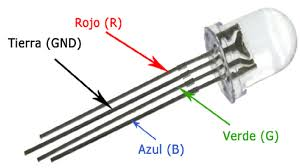
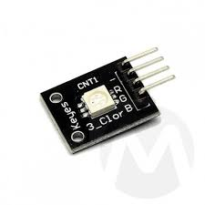
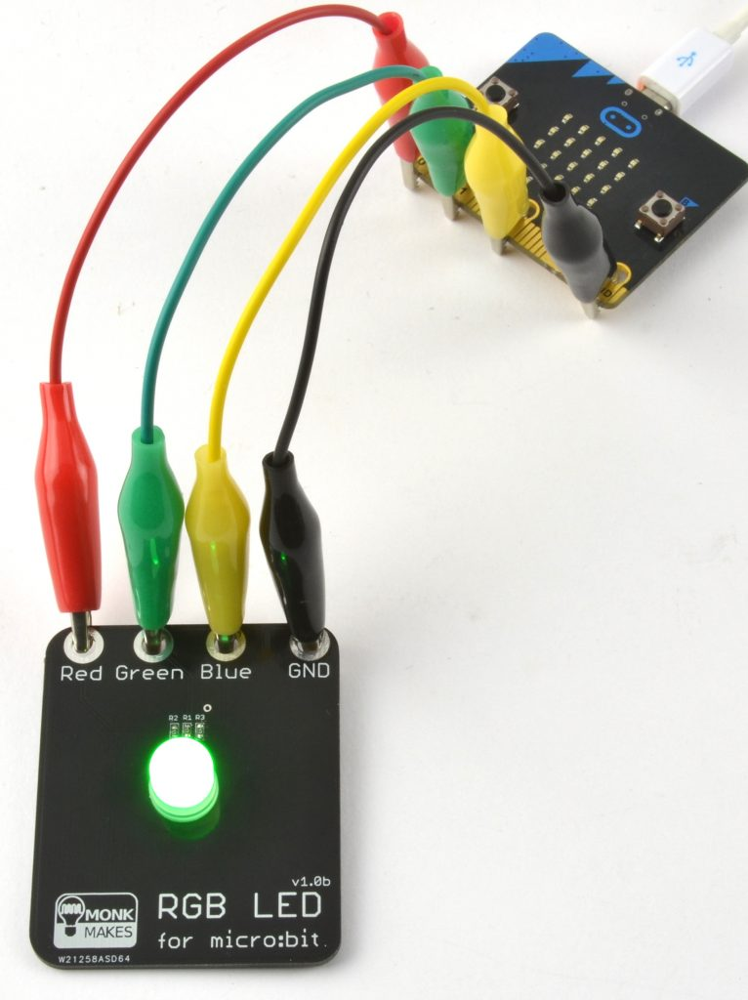

# Controlar un LED RGB

Els LED RGB són LED amb els quals podem controlar el color. El LED té 4 potes anomenades R (red), G (green), B (blue) i GND (terra). Podem controlar el color del led fent combinacions entre els tres colors. Si combinem vermell i blau ens sortirà un magenta, si barregem verd i blau ens sortirà un cian i barrenjant vermell i verd ens sortirà groc.

A la figura de sota podem veure un led RGB:

<div align="middle">

</div>

A la figura següent s’observa un LED RGB SMD (surface mount device):

<div align="middle">

</div>

Per a controlar la manera de barrejar els colors podem fer servir la tècnica PWM (veure controlar la brillantor d’un LED).

## Connexió amb la micro:bit

<div align="middle">

</div>

## Codi

Amb el codi següent podem veure com fer per canviar el color i la intensitat de la llum d’un LED introduint la component de cada color amb un valor entre 0 i 1023 per indicar la intensitat de la llum. El codi següent correspon a la connexió de la figura anterior.


```python
from microbit import *

def set_rgb(red, green, blue):
 pin0.write_analog(red)
 pin1.write_analog(green)
 pin2.write_analog(blue)

while True:
 set_rgb(255, 0, 0)
 sleep(4000)
 set_rgb(800, 100, 0)
 sleep(1000)
 set_rgb(0, 1023, 0)
 sleep(5000)
 set_rgb(800, 100, 0)
 sleep(1000) 
```
