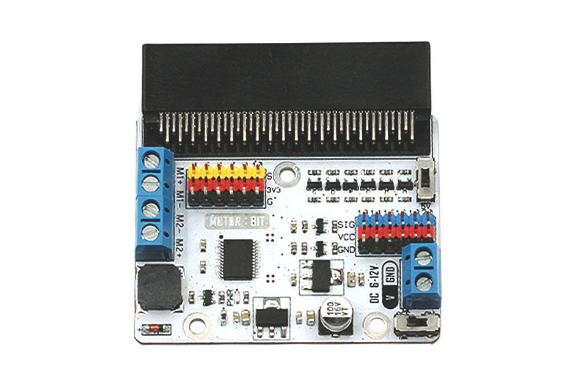

# Contolar motors amb micro:bit

## La placa motor:bit

La placa micro:bit no té prou potència per a alimentar motors i a més a més necessita un circuit controlardor per als motors. Per a controlar motors amb la micro:bit utilitzarem una placa controladora que és una extensió de la micro:bit anomenada motor:bit. A més a més aquesta placa permer accedir als altres pins de la micro:bit.per a connectar sensors. Els pins disponibles per a connectar sensors són P0, P3-P7, P9-P10 amb un voltatge de 3,3V només. Els pins P13-P16, P19-P20 suporten sensors amb un voltatge de 3,3V o 5V. Podeu canviar el voltatge canviant el selector de voltatge a la placa

<div align="middle">

</div>

### Característiques del hardware
* Motor Drive Chip: TB6612
* Suporta connectors GVS-Octopus
* Alguns connectors GVS que suporten voltatges de 3.3V o 5V.
* Amb 2 canals per a connnectar motors de CC, corrent max per canal 1.2A.
* Voltatge d'entrada: 6-12V CC
* Dimensions: 60.00mm X 60.10mm
* Pes: 30 g

### Informació dels connectors

<div align="middle">

</div>

<div align="middle">

</div>

### Detalls d'alguns connectors

1. Selector 3,3V-5V: Aquest selector controla el nivell de voltatge als pins blaus (P13, P14, P15, P16, P19 i P20) de la motor:bit. Quan aquests pins estan a 5V, també ho estan els pins vermells. De la mateixa manera quan els pins blaus estan amb voltatge de 3,3V, també ho estaran els pins vermells.

    <div align="middle"></div>

2. Connectors de pins digitals: P4, P5, P6, P7, P9 i P10
    Connector G-3V3-S: 3V3 es refereix a 3,3V d'alimentació, G per GND i S per Senyal. GVS és un connector de sensors estàndard que permet connectar directament a servos o sernsors de manera directa, suporta els productes d'Octopus.

    <div align="middle"></div>

3. Connector GND-VCC-SIG amb nivell elèctric dual de 3.3V/5V: P13, P14, P15, P16, P19 i P20. la particularitat d'aquests connectors és que suporten 3,3V i 5V i també suporten els productes Octopus.

    <div align="middle"></div>

4. Connector de motors: Dues regletes per a connexió dels motors en total. 

    <div align="middle"></div>

    Per a controlar els motors seguiu les instruccions de la taula de sota.

<div align="middle">
<style>
th td {text-align: left;}
</style>
<table>
<tr>
<th>Pin</th><th>Funció</th><th>Nota</th>
</tr>
<tr>
<td>P8</td>
<td>Control de direcció de M1</td>
<td>Rotació positiva amb alt voltatge, rotació negativa amb baix voltatge</td>
</tr>
<tr>
<td>P1</td>
<td>Control de velocitat de M1</td>
<td>PWM</td>
</tr>
<tr>
<td>P2</td>
<td>Control de velocitat de M2</td>
<td>PWM</td>
</tr>
<tr>
<td>P12</td>
<td>Control de direcció de M2</td>
<td>Rotació positiva amb alt voltatge, rotació negativa amb baix voltatge</td>
</tr>
</table>
</div>

## Exemple de connexió

### Connexionat del motor

El motor s'ha de connectar com s'indica a la figura de sota:

<div align="middle">

</div>

### Programació

Rotació positiva del motor:


```python
from microbit import *

pin8.digital_write(1)   # rotació positiva del motor 1 (0 per a rotació negativa)
pin1.analog_write(1023) # fa funcionar el motor 1 a tota velocitat

pin12.digital_write(1) # rotació positiva del motor 2 (0 per a rotació negativa)
pin2.analog_write(1023) # fa funcionar el motor 2 a tota velocitat
```

Els valors dels `pin1` i `pin2` controlen la velocitat del motor pel mètode PWM (Pulse Width Modulation).

### Referències

[https://www.elecfreaks.com/store/blog/elecfreaks-motorbit-user-guide.html](https://www.elecfreaks.com/store/blog/elecfreaks-motorbit-user-guide.html)
