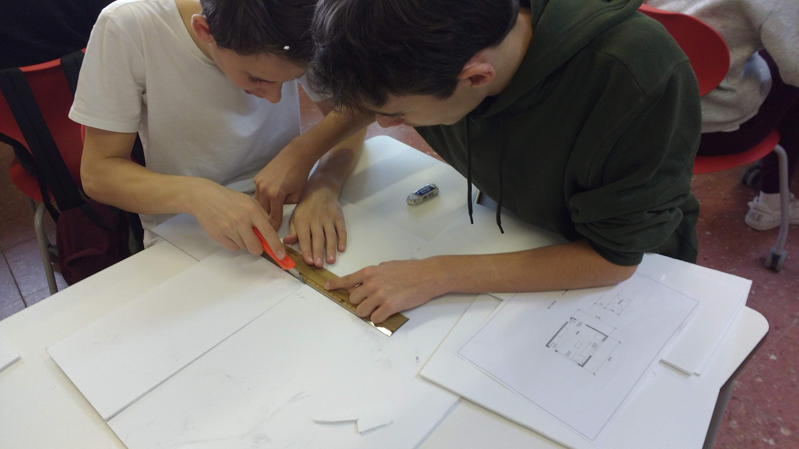
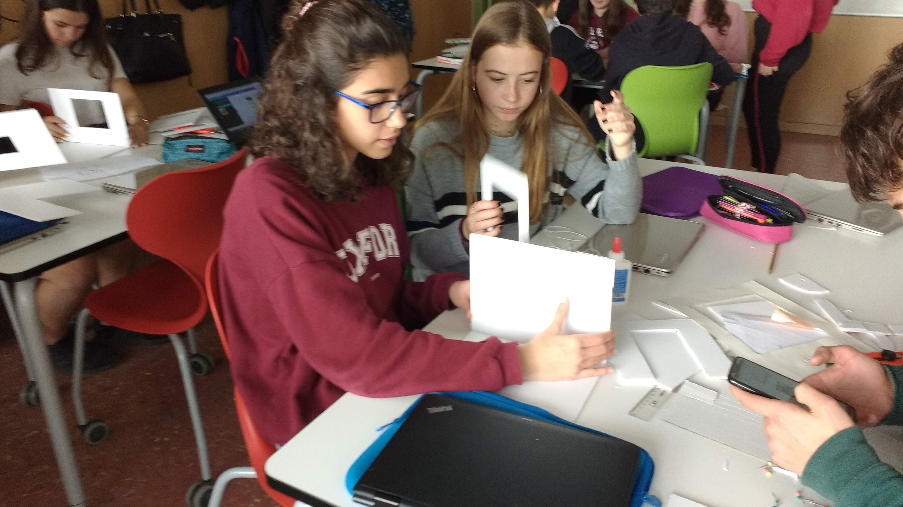
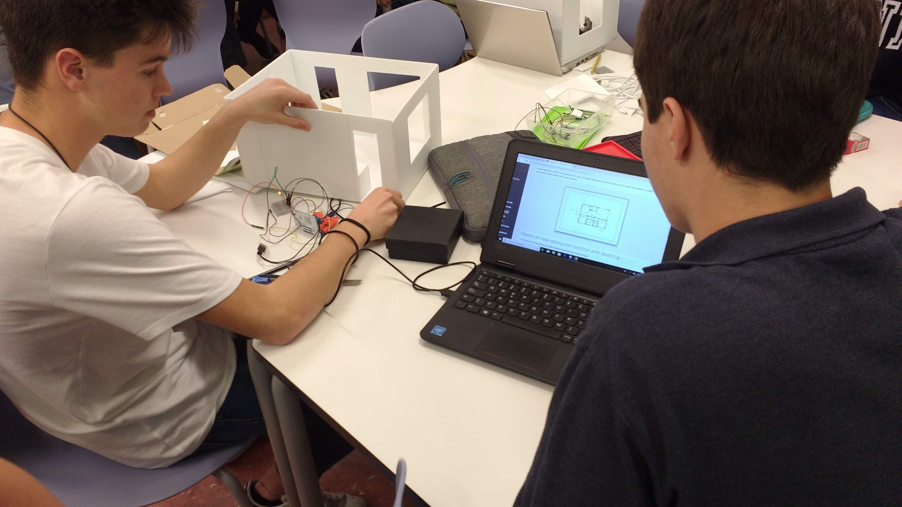
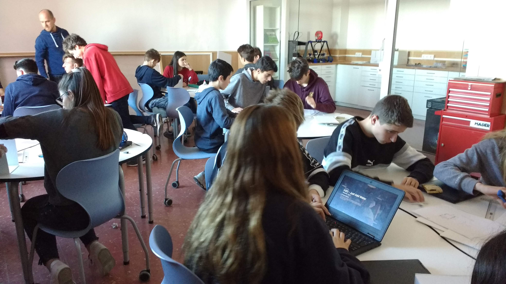
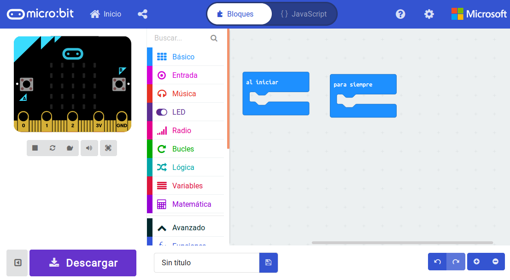
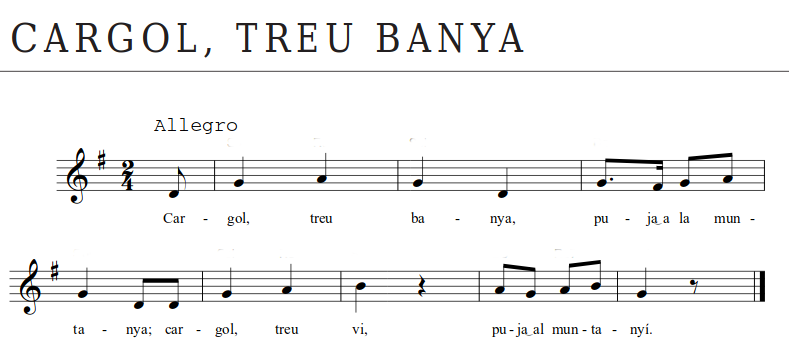
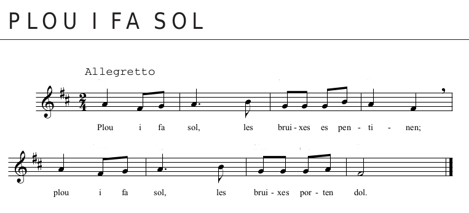
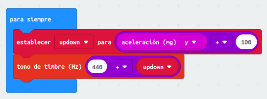
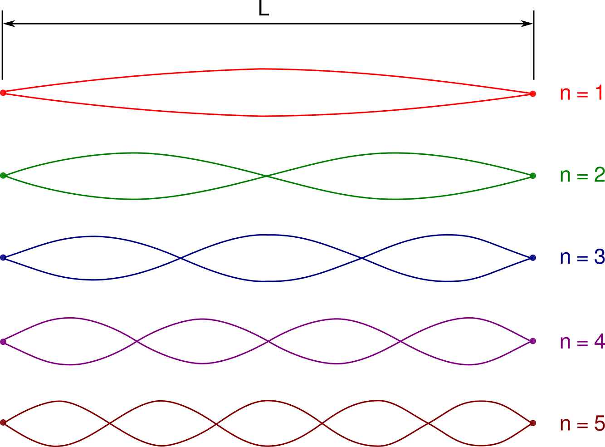

# Música amb BBC micro:bit

## Introducció a la placa micro:bit

    </a>

## La plana web de referència: [https://microbit.org](https://microbit.org)

    

## Utilització en projectes interdisicplinaris: Domus

    

    

    

    

## Començar a programar

    

## Fem una mica de música

    

### Repte:

    

## Theremin

<iframe width="560" height="315" src="https://www.youtube.com/embed/K6KbEnGnymk"></iframe>

### Codi d'exemple

    

### Repte senzill
* Quin efecte té canviar el número 440 en el to?
* Què passa quan canviem el nombre pel que dividim?

### Repte intermig
Com podem fer per a que el theremin funcioni amb el moviment dels tres eixos?

### Repte avançat
Podem canviar el codi per a obtenir una nota diferent per a cada inclinació cada 100 ms, en lloc de un canvi continu de to?

## Música i matemàtiques

    

