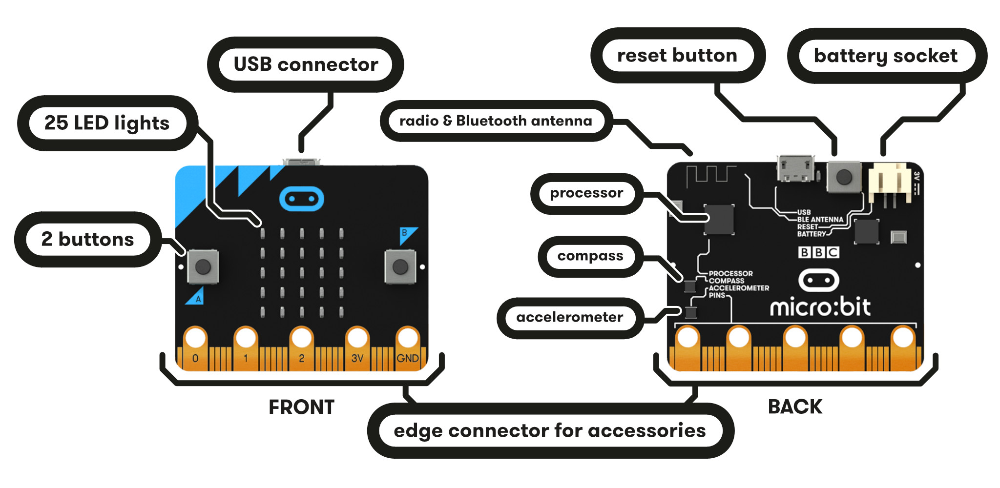

# Música amb BBC micro:bit

## Introducció a la placa micro:bit

    </a>

## La plana web de referència: [https://microbit.org](https://microbit.org)

    

## Utilització en projectes interdisicplinaris: Domus

<video width="320" height="240" controls>
  <source src="path/to/your.mp4" type="video/mp4">
</video>

## Melodies incorporades

Hi ha un conjunt de melodies que ja venen incorporades amb el mòdul music de mic

## Theremin

<iframe width="560" height="315" src="https://www.youtube.com/embed/K6KbEnGnymk"></iframe>

