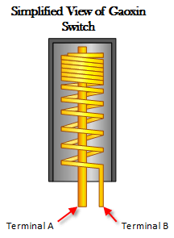
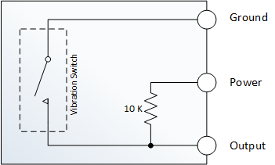

# Sensors de vibracions

A la figura podem veure un mòdul sensor de vibració KY-002.


Aquest sensor utilitza un interruptor de vibració Gaoxin SW-18010P i permet detectar impactes, cops i sacsejades o tremolades. Aquest interruptor consisteix en un terminal que forma una barra central i una molla que rodellal'eix central. Quan una força suficient es transfereix al interruptor i la molla es mou i els dos terminals s'ajunten temporalment. El posicionament de l'interruptor és important, es a dir, que l'interruptor ha d'estar tan a prop com sigui posible de l'àrea a monitoritzar. En cas contrari, la vibració detectada por ser amortiguada per altres components estructurals del projecte. En cas contrari, si l'interruptor resulta massa sensible per a la vostra aplicació proveu d'allunyar una mica el sensor de la zona a mesurar.



A la imatge de sota es pot apreciar l'esquema intern del mòdul KY-002.



Podem veure de l'esquema que quan es detecta una vibració, l'interruptor es tanca i el pin que estigui connectat a la sortida del mòdul, que estava detectant un valor `HIGH` passarà a estar en un estat `LOW` perquè passa a estar connectat a `GND`.

Farem un codi de prova que faci encendre un LED quan el sensor detecti una vibració. A continuació tenim el llistat del programa:


```python
from microbit import *

while True:
    # connectem la sortida del sensor al pin 6 de la microbit
    shock = pin6.read_digital()
    if shock == True:
        display.show(Image.YES)
    else:
        display.show(Image.NO)
    sleep(500)

```
