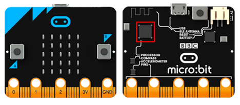
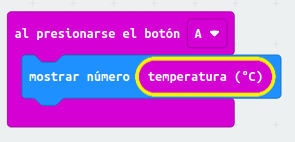
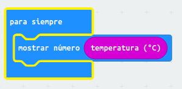

# Mesurar temperatura amb la placa micro:bit

La manera més fàcil de mesurar temperatura amb la placa micro:bit és fent servir el sensor de temperatura que té incorporat el microprocessador de la placa. La funció d'aquest sensor és la de poder monitoritzar la temperatura del xip però com aquest no puja la temperatura de manera significativa, el podem fer servir per mesurar la temperatura ambient, sobre tot quan fa poc que s'ha posat en funcionament i encara no ha tingut temps d'escalfar-se. A sota podem veure la ubicació del processador (indicat en vermell), el sensor de temperatura es troba a dintre del processador.
<br>
<div align="middle">

</div>
<br>

En aquest vídeo tenim una introducció al sensor de temperatura:

<div align="middle">
<iframe width="560" height="315" src="https://www.youtube.com/embed/mrHn8eZ9eqg" frameborder="0" allow="accelerometer; autoplay; clipboard-write; encrypted-media; gyroscope; picture-in-picture" allowfullscreen></iframe>
</div>

## El codi

Per llegir el valor de temperatura del sensor intern amb el llenguatge de blocs [MakeCode](https://makecode.microbit.org/) podem fer servir el següent codi:
<br>
<div align="middle">

</div>
<br>
D'aquesta manera, quan premem el botó A el valor de la temperatura apareix a la matriu de leds de la micro:bit.

El codi equivalent en Python es:


```python
from microbit import *

while True:
    if button_a.was_pressed():
        display.scroll(temperature())
```

## Prendre'ns la temperatura corporal

Per prendre'ns la temperatura en comptes de demanar que ens doni la temperatura prement un botó podem fer que els programa ens doni la temperatura constantment amb el codi que veiem a sota:

<br>
<div align="middle">

</div>
<br>


El codi equivalent en Python és:


```python
from microbit import *

while True:
    display.scroll(temperature())
```

La placa mesura la temperatura amb nombres enters, la qual cosa no la fa adient per saber si tenim febre però sí ens permet tenir una idea, si ens mesurem la temperatura i ens indica 36 podem estar tranquils, si ens indica 37, millor assegurar-nos amb un altre termòmetre que estigui homologat. Aquest podria ser el criteri. 

**NOTA IMPORTANT: Aquesta manera de mesurar la temperatura corporal té una finalitat didàctica i en cap cas pot reemplaçar la utilització de termòmetres homologats.**

Per prendre'ns la temperatura podem posar en contacte el processador amb el front durant una estona.


## Mesurar la temperatura amb un sensor extern
Si volem mesurar la temperatura amb un sensor extern i obtenir una mesura amb major precisió podem fer servir el tutorial https://www.teachwithict.com/temp.html on es fa servir el sensor [TMP36](https://www.analog.com/media/en/technical-documentation/data-sheets/TMP35_36_37.pdf). Hem de recordar que si fem servir un sensor extern hem de fer una calibració del sensor o fer servir les corbes de calibració proveïdes pel fabricant.

