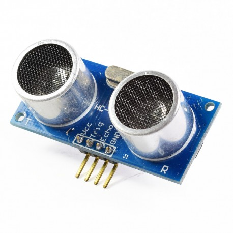
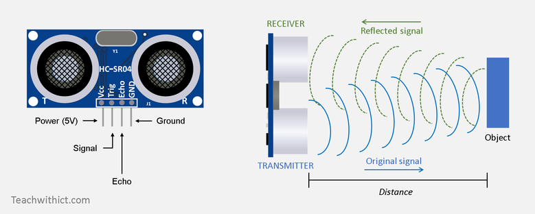
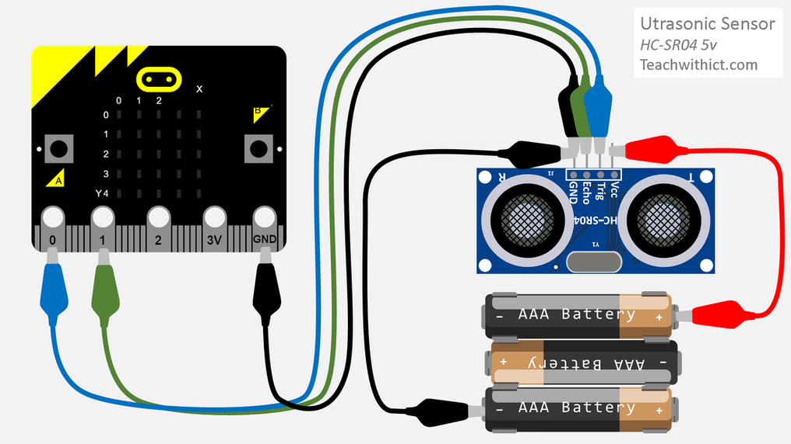

# Sensor de distància per ultrasons

## Funcionament del sensor
El sensor d'ultrasons funciona enviant una ona d'alta freqüència i calculant el temps que pren el senyal en tornar (ressò). El sensor té un emissor i un receptor que es poden veure a la figura de sota. L'ona emesa viatja a la velocitat del so (341 m/s) a l'aire. Utilitzant aquesta informació, juntament amb el temps que tarda l'ona en anar i tornar des de l'obstacle trobat, la placa micro:bit pot determinar a quina distància es troba l'objecte.

<div align="middle">

</div>


$$\text{Distància a l'objecte} = \frac{T}{2}\times \text{velocitat del so}$$

on $T$ és el temps emprat per l'ona en anar i tornar al sensor. Dividim el temps per 2 per tenir només el temps d'anada.

<div align="middle">

</div>


## Característiques del sensor HC-SR04
* Font d'alimentació: 5 V CC
* Corrent de treball: 15 mA
* Rang de distàncies: 2 cm a 400 cm
* Resolució: 0,3 cm
* Angle de mesura: 30 graus
* Dimensions: 45 mm x 20 mm x 15 mm

## Materials necessaris
* Placa micro:bit
* Cable USB per la micro:bit
* Shield micro:bit
* Power pack
* Cable pel Power pack
* Sensor HC-SR04
* Cables

## Connexions

A la figura inferior es pot apreciar el connexionat del sensor. Nosaltres utilitzarem el shield adaptador motor:bit per tant, tindrem que tenir en compte que les connexions al sensor sortiran del shield.

<div align="middle">

</div>

## Codi en micropython

Per fer funcionar el sensor haurem d'importar el mòdul `hcsr04` que el podrem descarregar [d'aquí](hcsr04.py) i l'haurem de copiar a la micro:bit per tal que estigui disponible per fer la importació del mòdul. En aquest mòdul els pins estan configurats perquè siguin:

* Pin 14: ECHO
* Pin 15: TRIGGER

Un possible codi en el qual es fa funcionar el sensor quan es prem el botó A es pot veure a continuació:


```python
from hcsr04 import HCSR04
from microbit import sleep, button_a, display


sonar = HCSR04()
while True:
    if button_a.is_pressed():
        distance = round(sonar.distance_mm()/10) #La distància es guarda en cm
        if distance < 10:
            display.show(str(distance))
        else:
            display.scroll(str(distance))
        while button_a.is_pressed():
            sleep(100)
    sleep(100)
```
